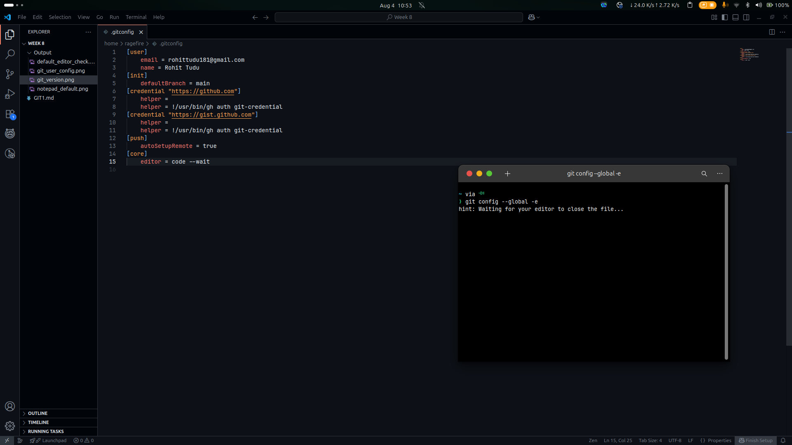
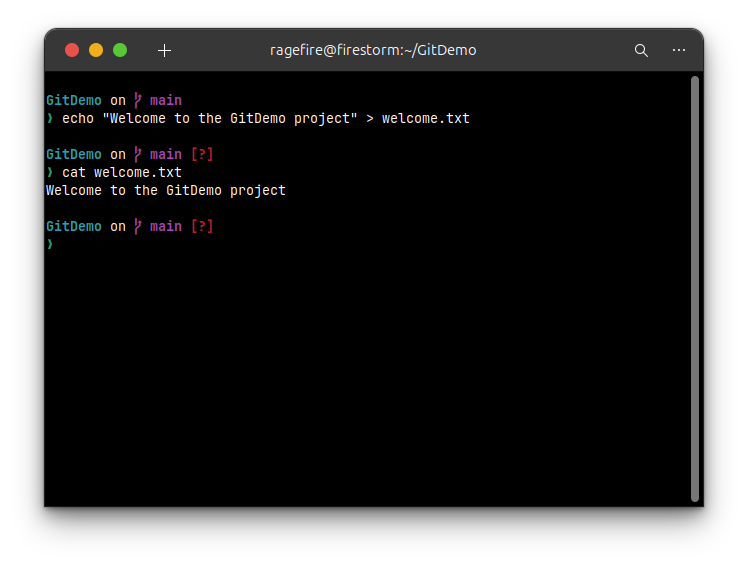

# Hands-On Lab: Git Fundamentals

### **1. Introduction and Objectives**

This document provides a step-by-step solution for the Git hands-on lab. The primary goal is to become familiar with fundamental Git commands for version control. By the end of this guide, you will have practical experience with initializing a repository, managing files, and synchronizing with a remote repository.

**Objectives:**
* Setup your machine with Git Configuration.
* Integrate notepad++.exe to Git and make it a default editor.
* Perform core Git operations such as `init`, `add`, `commit`, `push`, and `pull`.
* Add a file to a source code repository.

### **2. Prerequisites**

* Git is installed on your machine.
* **Note**: This demonstration will be performed using the default terminal on Linux Ubuntu.

---

### **Step 1: Setup Your Machine with Git Configuration**

Before using Git, it's essential to configure your user identity. This information is embedded into every commit you make.

1.  **Open Terminal**: Launch the terminal. You can verify that Git is installed correctly by checking its version.
    ```bash
    git --version
    ```
    

2.  **Configure User ID and Email**: Execute the following commands in the terminal to set your global user name and email address. Replace `"Your Name"` and `"your.email@example.com"` with your actual details.
    ```bash
    git config --global user.name "Your Name"
    git config --global user.email "your.email@example.com"
    ```
    **(Screenshot Placeholder: Terminal after executing the two git config commands. No output is expected.)**

3.  **Verify Configuration**: To check that the configuration has been set properly, run the following command.
    ```bash
    git config --list
    ```
    

---

### **Step 2: Integrate Notepad++ as the Default Editor**

**Note for the Reviewer:** The following steps detail how to integrate Notepad++.exe as the default Git editor. As Notepad++ is a Windows application and not available on my Linux Ubuntu system, I will not be executing these specific commands. Git will proceed with its own default editor (like Vim or Nano) for operations requiring text input.

Git often requires you to enter text, such as a commit message. Configuring a custom default text editor like Notepad++ can make this process easier on Windows.

1.  **Configure the Editor**: To set Notepad++ as Git's default editor, you would execute the following command.
    ```bash
    git config --global core.editor "notepad++ -multiInst -notabbar -nosession -noPlugin"
    ```
    

2.  **Verify the Default Editor**: To confirm that Notepad++ is the default editor, you can execute the verification command.
    ```bash
    git config --global -e
    ```
    

    ### Changed default editor to VSCode since Notepad++ isn't available on Linux/Ubuntu
    

---

### **Step 3: Add a File to the Source Code Repository**

This section covers the core workflow: creating a repository, adding a file, and committing it.

1.  **Create a Project Directory**: First, create a new folder for your project named `GitDemo` and navigate into it.
    ```bash
    mkdir GitDemo
    cd GitDemo
    ```
    

2.  **Initialize the Repository**: Inside the `GitDemo` directory, initialize a new Git repository.
    ```bash
    git init
    ```

    Verifying the hidden `.git` directory was created by listing all files.
    ```bash
    ls -la
    ```
    or (on Ubuntu/linux)
    ```bash
    ls -a
    ```
    

3.  **Create and Stage a File**:
    * Create a new file named `welcome.txt` with some content.
        ```bash
        echo "Welcome to the GitDemo project" > welcome.txt
        ```

    * Verify the file's content.
        ```bash
        cat welcome.txt
        ```

    

    * Check the status of your repository. Git will show `welcome.txt` as an "untracked file".
        ```bash
        git status
        ```

    * To make the file tracked by the Git repository, you need to add it to the staging area.
        ```bash
        git add welcome.txt
        ```
    

    * Run `git status` again. The file will now appear under "Changes to be committed".

        ```bash
        git status
        ```

    

4.  **Commit the File**:
    * Now, commit the staged file. Executing `git commit` without a message flag will open the default editor.
        ```bash
        git commit
        ```

    * After saving the message in the editor, check the status one last time to see that your working directory is clean.
        ```bash
        git status
        ```
    

---

### **Step 4: Synchronize with a Remote Repository**

After committing changes locally, the next step is to push them to a shared remote repository.

* **Note**: Before you can push or pull, you must first link your local repository to a remote one using the `git remote add origin <URL>` command. This lab assumes a remote named "origin" has already been configured.

1.  **Push to the Remote Repository**: To upload your local commits to the `master` branch of the remote repository, execute the `git push` command.
    ```bash
    git push origin master
    ```
    

2.  **Pull from the Remote Repository**: To download changes from the remote repository to your local machine, execute the `git pull` command.
    ```bash
    git pull origin master
    ```
    

### **Conclusion**

This hands-on lab covered the essential Git workflow. You have successfully configured your Git environment, created a local repository, tracked and committed a file, and synchronized your work with a remote repository. These commands form the foundation of effective version control with Git.
