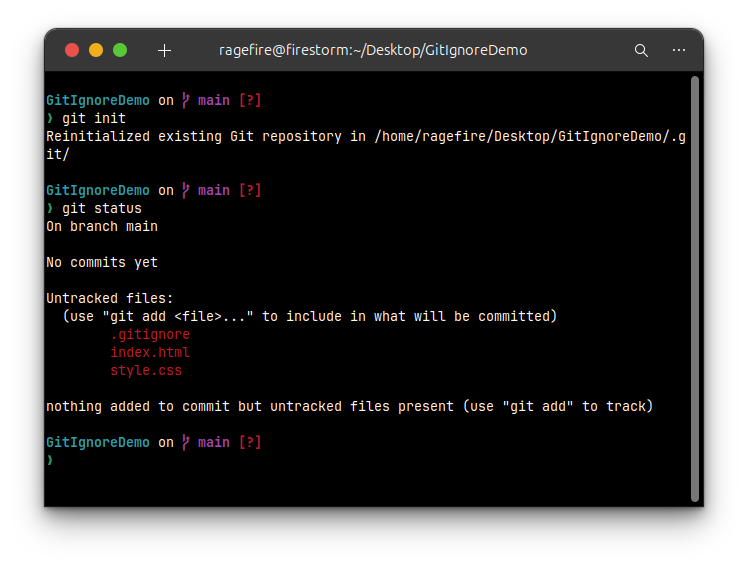
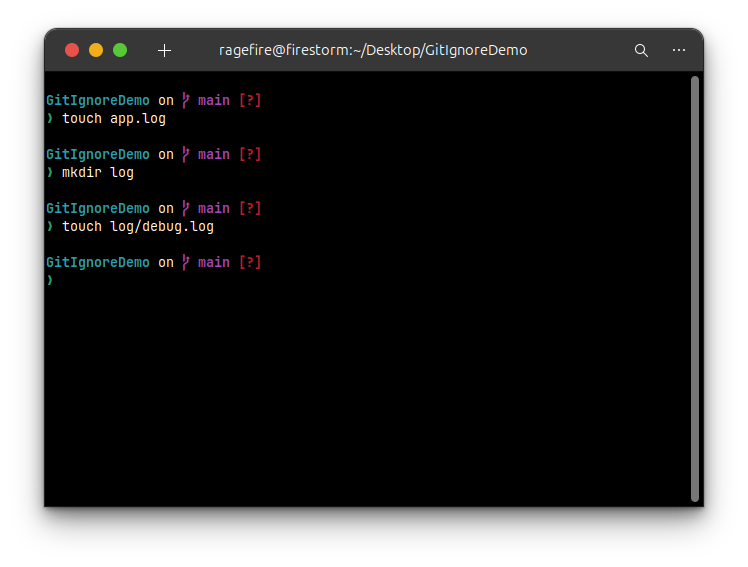
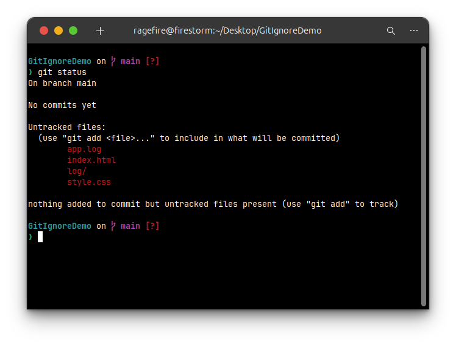
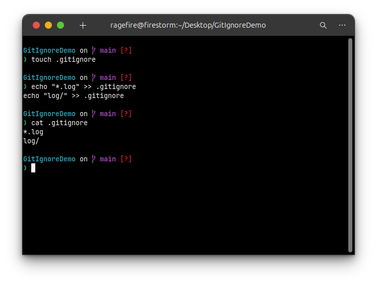
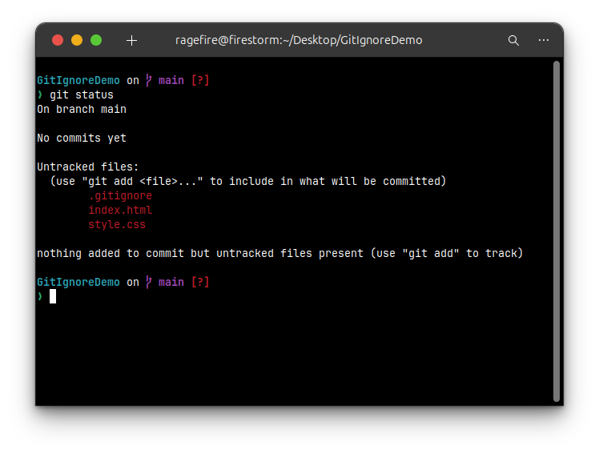
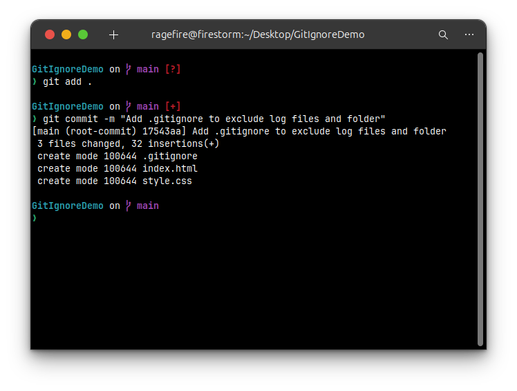
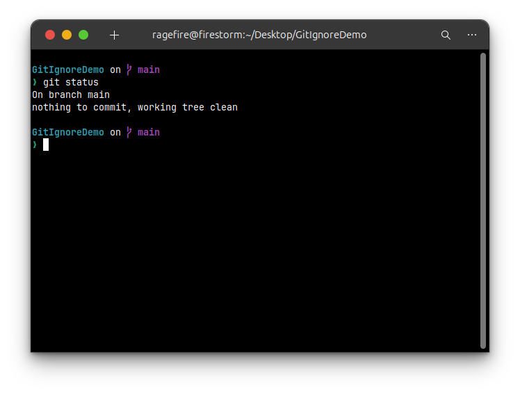

# Hands-On Lab Solution: Ignoring Files with .gitignore

### **1. Introduction and Objectives**

This document provides a step-by-step solution for the hands-on lab focused on using the `.gitignore` file. The purpose of a `.gitignore` file is to tell Git which files or folders it should intentionally ignore and not track.

**Objectives:**
* Explain what `gitignore` is and how it works to ignore unwanted files.
* Implement the `.gitignore` functionality to ignore specific files and folders.
* Verify that the ignored files and folders are not tracked by Git.

### **2. Prerequisites**

* A working Git environment is set up.
* A local Git repository exists (we will continue using the `GitDemo` repository from the previous lab).
* The default text editor is configured (Notepad++ for Windows, or a default like Vim/Nano on Linux).
* **Note**: This demonstration will be performed using the default terminal on Linux Ubuntu.

---

### **Step-by-Step Solution**

This solution will guide you through creating files that should be ignored, setting up the `.gitignore` file to ignore them, and verifying the result.

#### **Step 1: Prepare the Working Directory**

First, navigate to your existing `GitDemo` project directory and check its current status to ensure there are no pending changes.

```bash
cd gitignore
git status
````


#### **Step 2: Create Files and Folders to be Ignored**

As per the lab requirements, we need to create a `.log` file and a `log` folder. We will also add a file inside the `log` folder to demonstrate that the entire folder's contents are ignored.

1.  **Create a log file:**

    ```bash
    touch app.log

2.  **Create a log folder with a file inside it:**

    ```bash
    mkdir log
    touch log/debug.log
    ```
    

3.  **Verify the new files with `git status`:**

    ```bash
    git status
    ```

    At this point, Git sees the new `app.log` file and the `log/` directory as "untracked files".

    

#### **Step 3: Create and Configure the `.gitignore` File**

Now, we will create the `.gitignore` file and add rules to ignore all files with a `.log` extension and the entire `log` directory.

1.  **Create the `.gitignore` file:**

    ```bash
    touch .gitignore
    ```

2.  **Add the ignore patterns to the file.** You can use a text editor like `nano` or `vim`, or use the `echo` command as shown below. The `*` is a wildcard that matches any sequence of characters.

    ```bash
    echo "*.log" >> .gitignore
    echo "log/" >> .gitignore
    ```

3.  **Verify the content of your `.gitignore` file:**

    ```bash
    cat .gitignore
    ```

    The output should show the two lines you just added.

    

#### **Step 4: Verify that the Files are Ignored**

Run `git status` again. You will now see that `app.log` and the `log/` folder are no longer listed as untracked. Git is correctly ignoring them. The only new untracked file that Git sees is the `.gitignore` file itself, which is expected.

```bash
git status
```



#### **Step 5: Commit the `.gitignore` File**

It is standard practice to add the `.gitignore` file to your repository. This ensures that the same ignore rules are shared with anyone else who clones the project.

1.  **Add the `.gitignore` file to the staging area:**

    ```bash
    git add .gitignore
    or git add .
    ```

2.  **Commit the staged file:**

    ```bash
    git commit -m "Add .gitignore to exclude log files and folder"
    ```
    
    

#### **Step 6: Final Verification**

Run `git status` one last time to confirm that your working directory is clean.

```bash
git status
```


### **Conclusion**

You have successfully configured a `.gitignore` file to prevent Git from tracking specific files and folders. You created rules to ignore files by their extension (`*.log`) and to ignore an entire directory (`log/`). Finally, you verified that `git status` respects these rules and committed the `.gitignore` file to the repository for future use.
