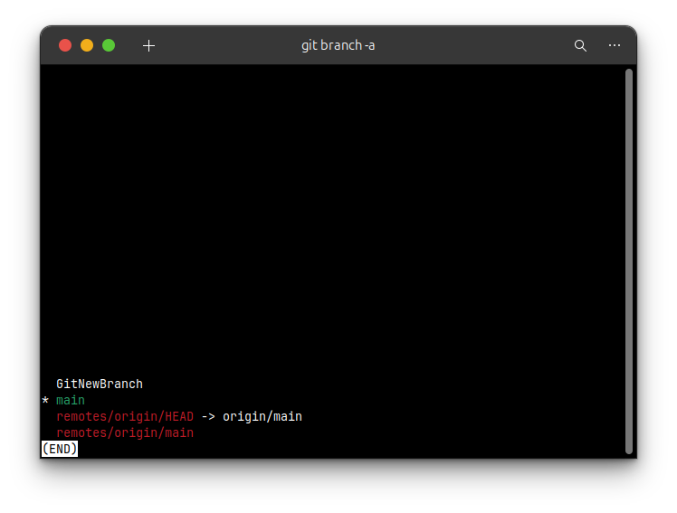
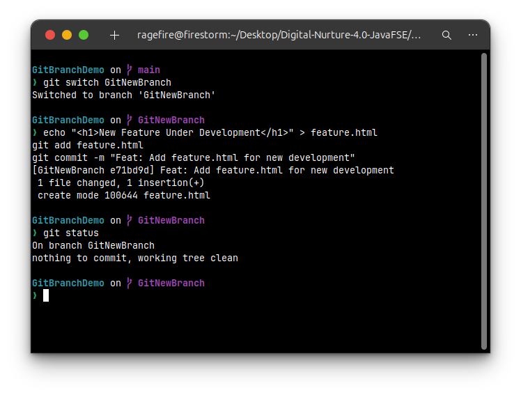
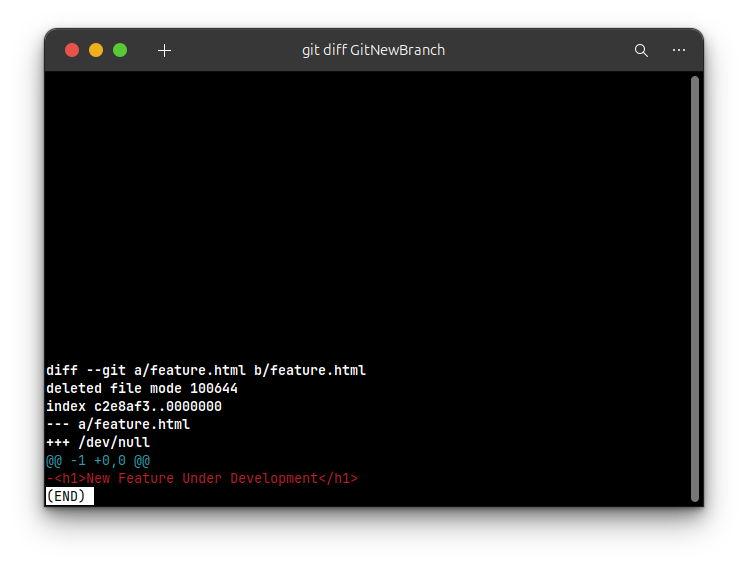
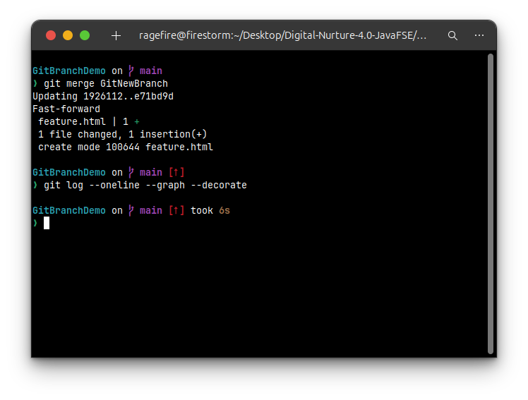
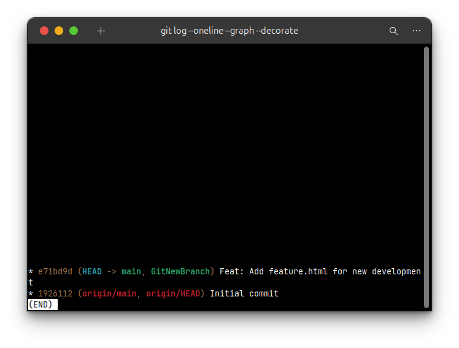
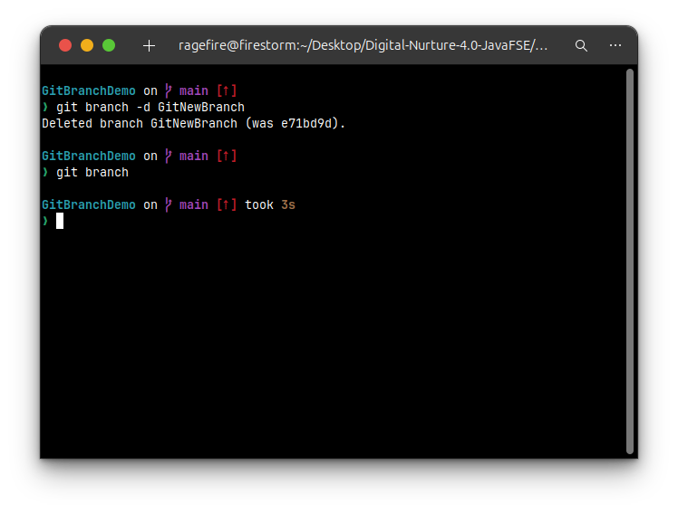
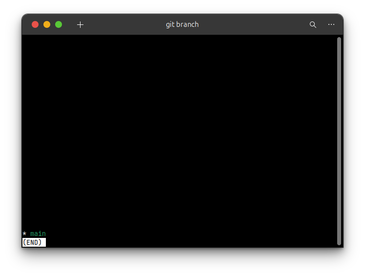

## **Hands-On Lab Solution: Git Branching and Merging**

#### **1. Introduction and Objectives**

This document provides a solution for the hands-on lab on Git's branching and merging capabilities. Branching allows for parallel development of features, bug fixes, or experiments without affecting the main codebase. Merging is the process of integrating the changes from a branch back into the main line of development.

**Objectives:**

  * Understand and explain branching and merging concepts.
  * Create a new branch and make changes within it.
  * Merge the changes from the feature branch back into the main branch.
  * Learn how to create branch and merge requests in a remote repository like GitLab.

#### **2. Prerequisites**

  * A working Git environment is set up.
  * A local Git repository exists. We will continue using the `GitIgnoreDemo` project.
  * **Note**: This demonstration is performed on a Linux terminal. The lab mentions the `P4Merge` tool for Windows to visually see differences. As this tool is not available on my system, I will use the standard command-line `git diff` tool as instructed.

-----

### **Part 1: Branching**

In this section, we will create a new branch, switch to it, and make some changes.

#### **Step 1: Create and List a New Branch**

First, ensure you are in your project directory. Create a new branch named `GitNewBranch`.

```bash
git branch GitNewBranch
```

Now, list all available local and remote branches to see the new branch.

```bash
git branch -a
```

The output will list all branches. The `*` mark denotes the branch you are currently on, which is still `main`.



#### **Step 2: Switch to the New Branch and Add Changes**

Switch your working context to the newly created `GitNewBranch`.

```bash
git switch GitNewBranch
```

Now that you are in the new branch, add a new file with some content and commit this change to the branch.

```bash
echo "<h1>New Feature Under Development</h1>" > feature.html
git add feature.html
git commit -m "Feat: Add feature.html for new development"
```

After the commit, you can check the status to confirm the working tree on this branch is clean.

```bash
git status
```


-----

### **Part 2: Merging**

In this section, we will merge the work completed in `GitNewBranch` back into the `main` branch.

#### **Step 1: Switch to main and View Differences**

First, return to the `main` branch.

```bash
git switch main
```

Next, check the differences between the `main` branch and `GitNewBranch`. This command will show the new file that exists in the branch but not in the trunk.

```bash
git diff GitNewBranch
```


#### **Step 2: Merge the Branch**

Execute the merge command to integrate the changes from `GitNewBranch` into your current branch (`main`).

```bash
git merge GitNewBranch
```

#### **Step 3: Observe the Commit History**

Use the recommended `git log` command to view the commit history as a graph. You will see the commit from `GitNewBranch` is now at the tip of `main`.

```bash
git log --oneline --graph --decorate
```



#### **Step 4: Delete the Merged Branch**

Now that the work from `GitNewBranch` has been successfully merged, the branch is no longer needed and can be safely deleted.

```bash
git branch -d GitNewBranch
```

You can list the local branches again to confirm `GitNewBranch` has been deleted.

```bash
git branch
```

