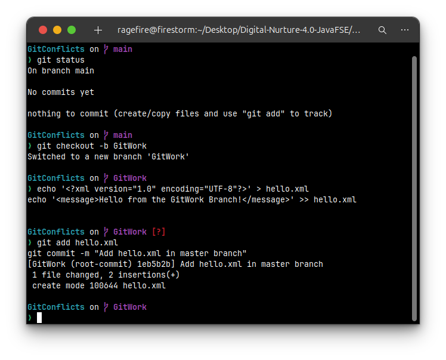
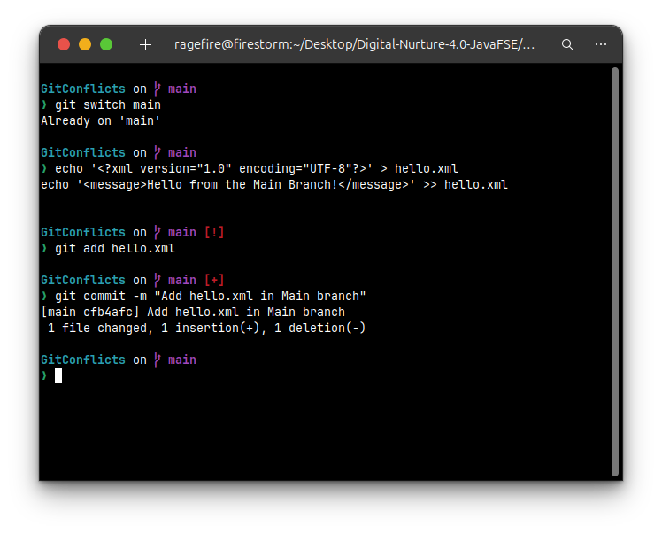
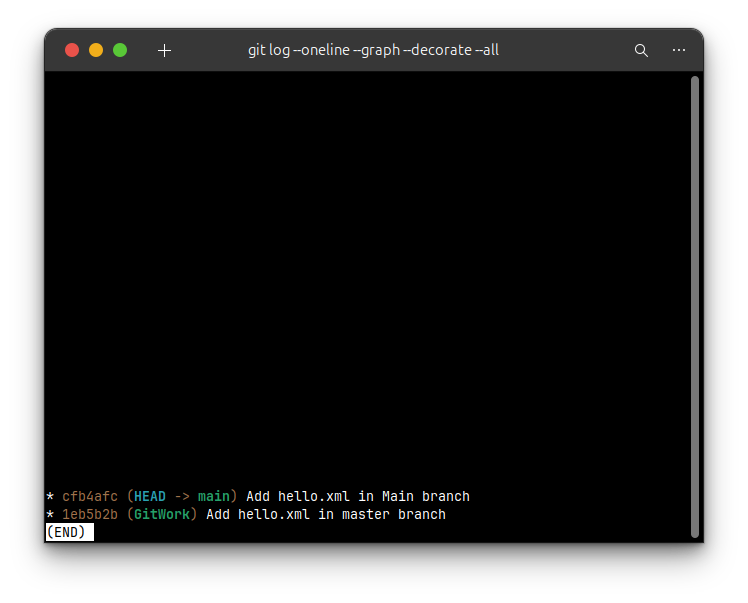
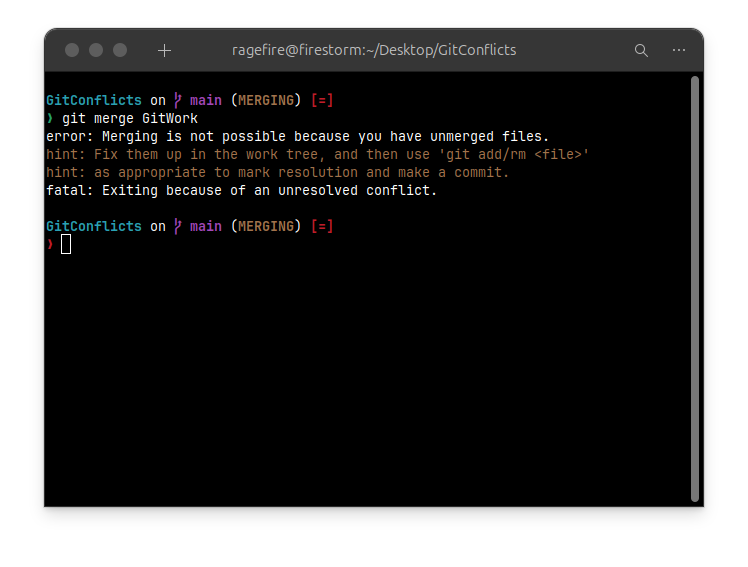
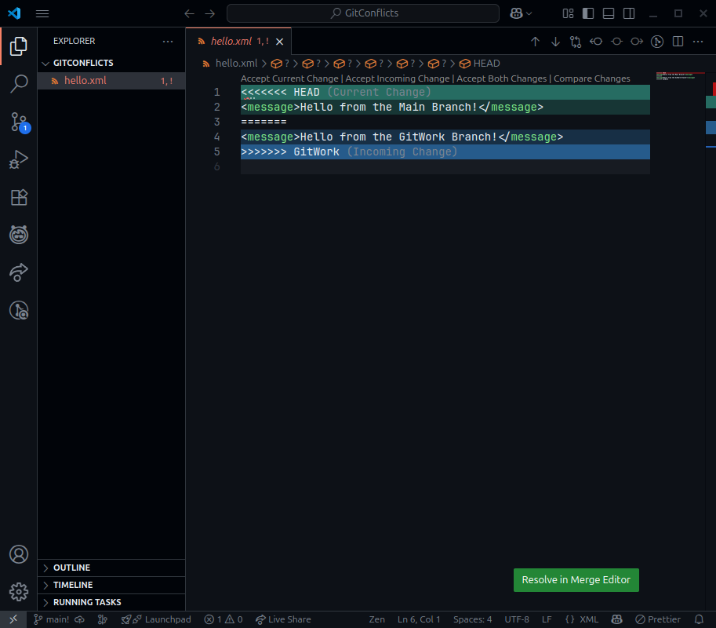
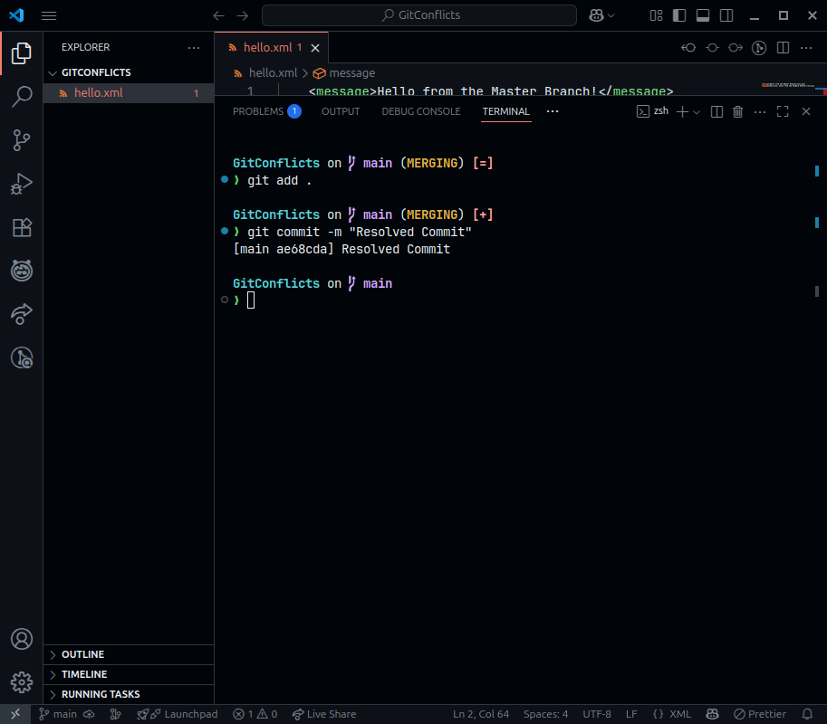
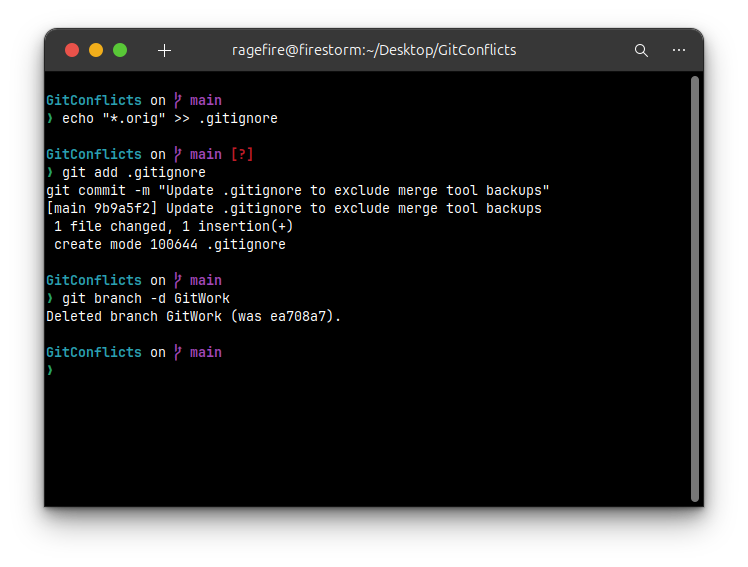
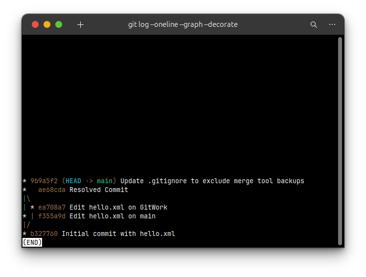

# Hands-On Lab Solution: Resolving Merge Conflicts in Git

### **1. Introduction and Objectives**

This document provides a step-by-step solution for the hands-on lab demonstrating how to handle and resolve merge conflicts in Git. A merge conflict occurs when Git is unable to automatically resolve differences in code between two commits. This typically happens when two developers have changed the same lines in the same file, or if one developer deleted a file while another developer was modifying it.

**Objectives:**
* Explain how to resolve a conflict that occurs during a merge.
* Implement conflict resolution in a scenario where diverging changes are made to the master branch and a feature branch.

### **2. Prerequisites**
* Successful completion of the previous hands-on lab, “Git-T03-HOL_001”.
* A working Git environment.
* **Note**: This demonstration is performed on a Linux terminal. The lab mentions the `P4Merge` tool for visual conflict resolution. As this tool is not available on my system, I will perform a manual resolution by editing the conflicted file in a standard text editor, which is the universal way to resolve conflicts.

---

### **Part 1: Creating a Merge Conflict**

To learn how to resolve a conflict, we must first create one intentionally.

#### **Step 1: Create a Branch and Make a Change**

1.  First, ensure your `master` branch is in a clean state.
    ```bash
    git status
    ```
2.  Create a new branch named `GitWork` and switch to it.
    ```bash
    git branch GitWork
    git switch GitWork
    ```
3.  In the `GitWork` branch, create a new file `hello.xml` with some content.
    ```bash
    echo '<?xml version="1.0" encoding="UTF-8"?>' > hello.xml
    echo '<message>Hello from the GitWork Branch!</message>' >> hello.xml 
    ```
4.  Stage and commit this change to the `GitWork` branch.
    ```bash
    git add hello.xml
    git commit -m "Add hello.xml in GitWork branch"
    ```
    

#### **Step 2: Create a Competing Change in Master**

1.  Switch back to the `master` branch.
    ```bash
    git switch master
    ```
2.  Now, create the *same file*, `hello.xml`, but add *different content* to it. This is the action that will cause the conflict.
    ```bash
    echo "<message>Hello from the Master Branch!</message>" > hello.xml
    ```
3.  Stage and commit this new file to the `master` branch.
    ```bash
    git add hello.xml
    git commit -m "Add hello.xml in master branch"
    ```
    

#### **Step 3: Observe the Diverged History**

At this point, both branches have a unique commit that the other does not. You can visualize this diverged history with the `git log` command.

```bash
git log --oneline --graph --decorate --all
````


-----

### **Part 2: Resolving the Conflict**

This section covers the process of attempting the merge, identifying the conflict, and resolving it.

#### **Step 1: Attempt the Merge**

While on the `master` branch, attempt to merge the `GitWork` branch.

```bash
git merge GitWork
```

Git will fail to merge automatically because it doesn't know which version of `hello.xml` to keep. The output will explicitly state a merge conflict.



#### **Step 2: Inspect the Conflict**

1.  Check the status. Git provides helpful information, showing the "unmerged paths."

    ```bash
    git status
    ```

2.  Open the conflicted file, `hello.xml`, in a text editor. You will see conflict markers that Git has inserted to show you the conflicting sections.

    ```
    <<<<<<< HEAD
    <message>Hello from the Master Branch!</message>
    =======
    <message>Hello from the GitWork Branch!</message>
    >>>>>>> GitWork
    ```

      * `<<<<<<< HEAD`: The content below this line is from your current branch (`master`).
      * `=======`: Separates the two conflicting versions.
      * `>>>>>>> GitWork`: The content below this line is from the branch you are trying to merge (`GitWork`).

    

#### **Step 3: Manually Resolve the Conflict**

To resolve the conflict, you must edit the file to look exactly how you want it to be, and you must remove the conflict markers. For this lab, we will combine the messages.

1.  **Edit `hello.xml`** to the following, then save the file:
    ```xml
    <message>Hello from the Master Branch!</message>
    <message>And also, hello from the GitWork Branch!</message>
    ```

#### **Step 4: Complete the Merge**

1.  Now that you have resolved the conflict, you must tell Git by adding the fixed file to the staging area.
    ```bash
    git add hello.xml
    ```
2.  Commit the changes to finalize the merge. Git will open an editor with a pre-populated merge commit message. You can simply save and close it.
    ```bash
    git commit
    ```
    

-----

### **Part 3: Cleanup After Merging**

The final steps involve cleaning up the repository.

#### **Step 1: Handle Backup Files (if created)**

Some merge tools create backup files (e.g., `hello.xml.orig`). If one was created, you should add its pattern to `.gitignore` to prevent it from being tracked.

1.  Add the pattern to `.gitignore`:
    ```bash
    echo "*.orig" >> .gitignore
    ```
2.  Commit the change to `.gitignore`.
    ```bash
    git add .gitignore
    git commit -m "Update .gitignore to exclude merge tool backups"
    ```

#### **Step 2: Delete the Old Branch**

Now that its work has been integrated, the `GitWork` branch can be deleted.

```bash
git branch -d GitWork
```


#### **Step 3: Observe the Final History**

Check the log one last time. You will now see a "merge commit" that ties the two previously diverged branches together.

```bash
git log --oneline --graph --decorate
```
