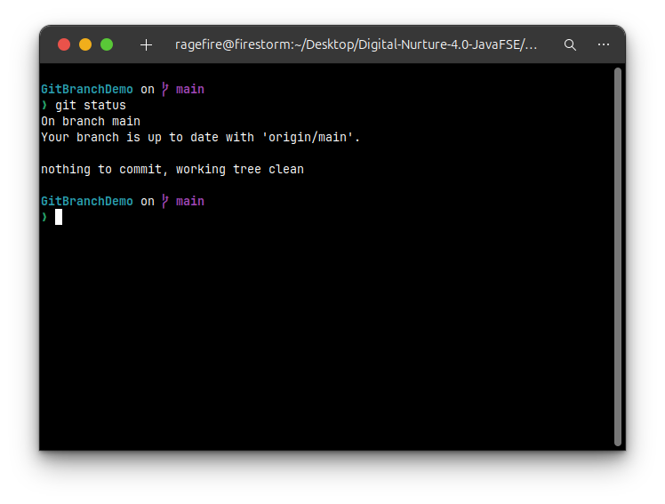
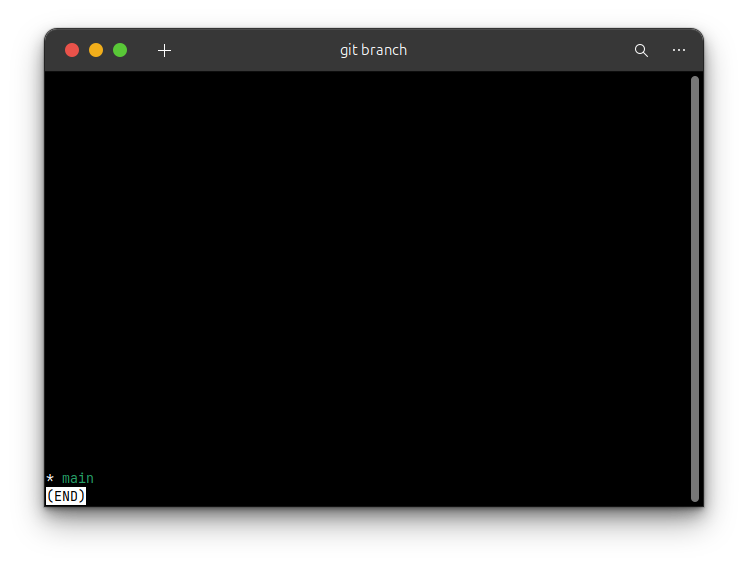
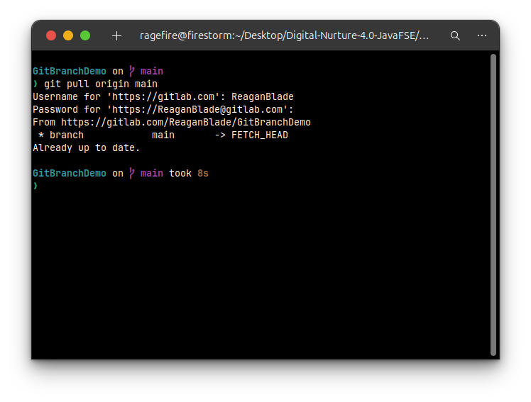
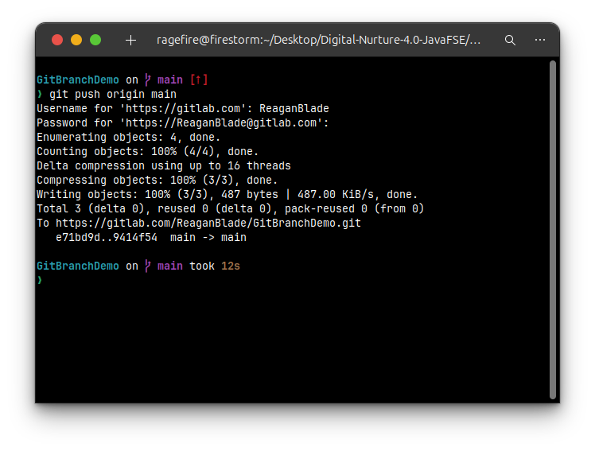
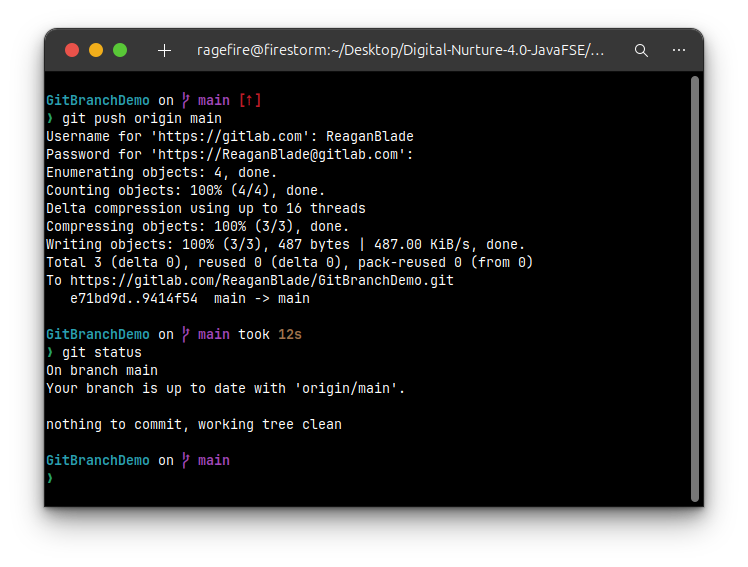

## **Hands-On Lab Solution: Cleanup and Pushing to Remote**

#### **1. Introduction and Objectives**

This document provides a step-by-step solution for the final hands-on lab in the Git series. The focus of this lab is to synchronize all the work completed locally—including adding files, creating branches, merging, and resolving conflicts—with a remote repository. This is a crucial final step in the development workflow, making your work accessible to others and creating a backup on a central server.

**Objectives:**

  * Explain how to clean up a local repository.
  * Push local changes to a remote Git repository.

#### **2. Prerequisites**

  * Successful completion of the previous hands-on lab, “Git-T03-HOL\_002”.
  * A local Git repository with a configured remote named `origin`.

-----

### **Step-by-Step Solution**

This solution will walk you through the final steps of verifying your local repository and pushing the changes to the remote.

#### **Step 1: Verify the Master Branch is in a Clean State**

Before pushing, it's essential to ensure your `master` branch is clean and has no uncommitted changes.

```bash
git status
```

The output should confirm that you are on the `master` branch and that you have a clean working directory.



#### **Step 2: List All Available Branches**

Verify that all temporary feature branches (like `GitNewBranch` and `GitWork`) have been deleted after their work was merged.

```bash
git branch
```

The output should only list the `master` branch, confirming that your local repository is tidy.



#### **Step 3: Pull from the Remote Repository**

It is a best practice to pull from the remote repository before you push. This fetches any changes that may have been made by other developers since your last pull, allowing you to resolve any potential conflicts locally first.

```bash
git pull origin master
```

Since you are the only one working on this repository, the output will likely state that you are "Already up to date."



#### **Step 4: Push All Local Changes to the Remote Repository**

Now, push all the commits you have made throughout these labs (adding files, merging branches, resolving conflicts) from your local `master` branch to the `origin` remote.

```bash
git push origin master
```

This command sends all of your local history to the remote repository. You may be prompted for your username and password.



#### **Step 5: Observe Changes in the Remote Repository**

The final step is to verify that your changes are now visible on the remote repository (e.g., on GitHub, GitLab).

1.  Open your web browser and navigate to your remote repository's URL.
2.  You should now see the file created (`index.html`) in the file list.
3.  Click on the "Commits" or "History" tab. You will see the log of all the commits you made locally, now reflected on the remote server.

